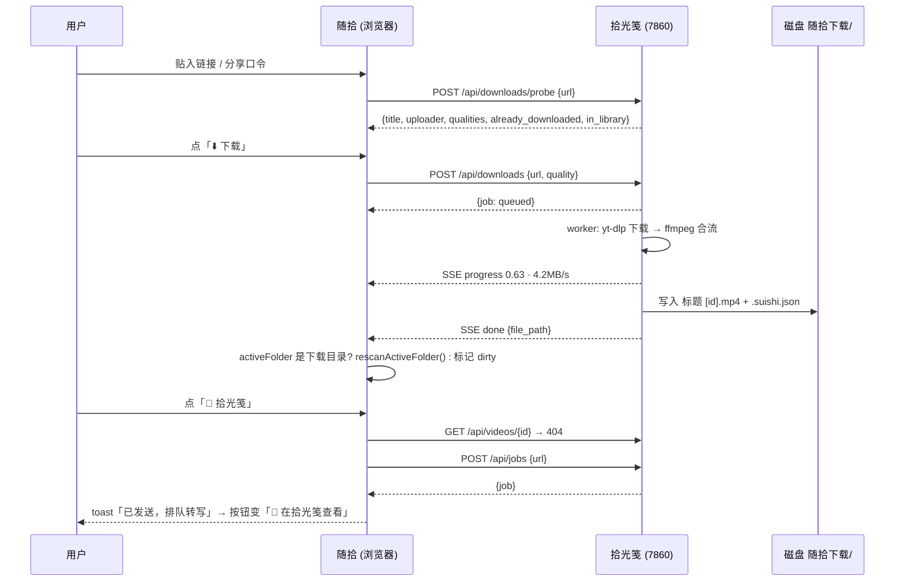

# 随拾 (SuiShi) · 「⬇️ 下载」页与拾光笺联动 设计文档

> 状态：v1 已实现（拾光笺 `f1e70e4` / 随拾 v1.3）。本文保留为设计依据；实现与文中的差异见文末「实现备注」。
> 目标：把 B 站 / 抖音上"怕被删"的视频存到本地，在随拾里直接看；并能一键把它送进拾光笺（Glean，`E:/personal/projects/video-summarizer`）做转写与总结。

---

## 0. 结论先行

| 问题 | 回答 |
| :--- | :--- |
| 能实现吗 | **能**，但**纯前端做不到**，必须有一个本机进程负责真正的下载（原因见 §2）。 |
| 值得吗 | **值得**。"存档 → 观看 → 转写总结"三件事分别正是 yt-dlp、随拾、拾光笺各自最擅长的，缺的只是一条把它们串起来的线。而且拾光笺已经把最难的部分（抖音签名风控、cookie、412 限流退避、任务队列落盘）都解决了。 |
| 怎么做 | **随拾自身不加后端**，把下载引擎放进拾光笺（它本来就是"从网上把视频拿下来"的服务，且日常常驻）。随拾只做一个可选的「下载」页，通过 `fetch` 与本机 `127.0.0.1:7860` 对话；连不上时该页降级为引导卡，随拾其他功能完全不受影响。 |
| 与 ROADMAP 红线的关系 | 红线是"随拾不引入 Node/Python 依赖型后端"。本方案中随拾仍是单文件、零构建、双击即开；**只是可选地连接一个已经存在的本机服务**。这是在"精神上"守住红线，但确实是第一次让随拾主动发起网络请求，README 中"不产生任何外发网络流量"的表述需要改写为："随拾自身不外发；下载功能仅经由本机拾光笺服务、且只在你主动贴入链接时联网"。 |

---

## 1. 需求拆解

**用户故事**

1. 我在 B 站 / 抖音刷到一个有用的视频，怕它以后被删，复制链接（或整段抖音分享口令）贴进随拾，点一下就存到本地。
2. 存好的视频自动出现在随拾的抽屉里，和其他本地视频一样能网格浏览、刷视频流、星标、断点续播。
3. 对这类视频我能一眼看出"它是从哪来的"，并能一键送去拾光笺出转写和总结；如果拾光笺里已经有了，直接跳过去看。

**v1 范围（做）**

- 单个视频链接的探测、下载（视频 + 音频合流为 mp4）、进度展示、失败重试
- 下载目录与随拾抽屉的一次性绑定，下载完成后自动增量刷新
- 来源元数据 sidecar，卡片 / 播放器上的来源徽标与「原链接」
- 一键「发送到拾光笺」/「在拾光笺中查看」

**v1 明确不做（留到后续）**

- 合集 / 多 P / UP 主空间的批量下载（拾光笺已有列表探测能力，v2 可直接接）
- 弹幕、字幕文件下载
- 订阅 UP 主自动追更
- Chrome 扩展右键"存到随拾"

---

## 2. 为什么纯前端做不到

| 障碍 | 说明 |
| :--- | :--- |
| CORS / Referer | B 站与抖音的媒体 CDN 校验 `Referer`，且不返回 `Access-Control-Allow-Origin`；浏览器页面里的 `fetch` 拿不到流。 |
| DASH 音视频分离 | B 站 1080p 及以上是 DASH，视频轨与音频轨是两个流，需要 ffmpeg 合流；浏览器内 WASM ffmpeg 体积 20MB+，与"轻量单文件"冲突。 |
| 抖音风控 | 详情接口要页面 JS 现算的签名参数（`a_bogus`、`x-secsdk-web-signature` 等），拾光笺是靠无头拉起本机 Chrome/Edge 让站点自己算好再交回 yt-dlp 的，浏览器沙箱里复现不了。 |
| 落盘 | File System Access API 能写文件（随拾已用 `readwrite` 权限做删除），但前面三关过不去，落盘环节没意义。 |

**已否决的替代方案**

| 方案 | 否决原因 |
| :--- | :--- |
| 随拾自带一个独立 Node 小服务（`dl-server.mjs` 包 yt-dlp） | 要重新解决抖音签名与 cookie 管理，等于把拾光笺 `douyin.py` 用 JS 再写一遍；用户还要多管一个进程。 |
| Electron / Tauri 壳 | 违背零构建、双击即开。 |
| 让拾光笺顺手把视频留下（它现在只下 `bestaudio`） | 方向对，但只留视频不够：还需要目录约定、sidecar、进度接口、去重——本质就是本文的方案。 |

---

## 3. 总体架构

```
┌──────────────────────────────────────────────────────────────────────────┐
│  浏览器 · 随拾 index.html (http://localhost:8964)                          │
│                                                                          │
│   侧栏「⬇️ 下载」 ──▶ #download-view                                       │
│      贴链接 → 探测卡 → 下载队列(SSE 进度) → 完成后「▶ 播放」「📝 拾光笺」    │
│                                                                          │
│   媒体库卡片 / 播放器：读取 *.suishi.json sidecar → 来源徽标、原链接、       │
│   「📝 发送到拾光笺」/「📖 在拾光笺查看」                                     │
└─────────────────────────────┬────────────────────────────────────────────┘
                              │ fetch / EventSource (CORS: 仅放行 localhost:8964)
                              ▼
┌──────────────────────────────────────────────────────────────────────────┐
│  拾光笺 · FastAPI (vsum ui, http://127.0.0.1:7860)                        │
│                                                                          │
│   新增 downloads 模块                                                     │
│     POST /api/downloads/probe   复用 probe()（含抖音浏览器兜底、cookie）     │
│     POST /api/downloads         入队，串行 worker，进度 hook → SSE          │
│     GET  /api/downloads[/…]     列表 / 详情 / 事件流 / 取消 / 定位文件        │
│                                                                          │
│   yt-dlp: bestvideo+bestaudio ──ffmpeg 合流──▶ mp4                          │
│   写入 download.video_dir/<站点>/<UP主>/<标题> [<id>].mp4                   │
│                                        + <同名>.suishi.json               │
│   历史落 cache.sqlite `downloads` 表（重启可续、可查重）                     │
│                                                                          │
│   既有 POST /api/jobs {url} ← 随拾「发送到拾光笺」直接调用                    │
└──────────────────────────────────────────────────────────────────────────┘
                              │
                              ▼ 同一块磁盘目录
┌──────────────────────────────────────────────────────────────────────────┐
│  E:\…\随拾下载\  ← 用户在随拾中通过 showDirectoryPicker 收藏过一次          │
│     BiliBili\某UP主\标题 [BV1xx].mp4        标题 [BV1xx].suishi.json        │
│     Douyin\某作者\标题 [7412…].mp4          标题 [7412…].suishi.json        │
└──────────────────────────────────────────────────────────────────────────┘
```

**职责边界**

- 随拾：只管 UI、目录句柄、与本机服务对话。不碰 yt-dlp、不存下载历史（单一事实来源在拾光笺 SQLite）。
- 拾光笺：所有联网、下载、落盘、元数据写入。对随拾暴露一组小而稳定的 HTTP 接口。
- 两者通过**文件系统 + sidecar** 松耦合：即使拾光笺没开，随拾依然能读到 sidecar 里的来源信息。

---

## 4. 拾光笺侧改动（Python，`video-summarizer`）

### 4.1 配置（`config.yaml` / `config.py`）

```yaml
download:
  # 新增：视频存档目录。留空 = 关闭下载接口（/api/downloads 返回 404）
  video_dir: "E:/Videos/随拾下载"
  # 新增：默认清晰度上限。best | 1080 | 720 | 480
  video_quality: 1080

web:
  # 新增：允许跨域调用的来源。只应填本机地址
  cors_origins: ["http://localhost:8964", "http://127.0.0.1:8964"]
```

`DownloadConfig` 增加 `video_dir: str | None = None`、`video_quality: str | int = 1080`；`WebConfig`（若无则新建）增加 `cors_origins: list[str]`。仅当 `cors_origins` 非空时挂 `CORSMiddleware`，且拒绝非 `localhost` / `127.0.0.1` 的 origin（配置校验时报错），避免误配成 `*`。

### 4.2 新模块 `downloads.py`

```python
@dataclass
class DownloadJob:
    id: str                       # 短随机 id
    url: str                      # extract_url 之后的规范链接
    video_id: str
    title: str
    uploader: str | None
    extractor: str                # BiliBili / Douyin / …
    thumbnail: str | None
    duration_sec: float
    quality: str                  # 请求时的清晰度
    status: Literal["queued", "downloading", "merging", "done", "failed", "cancelled"]
    progress: float = 0.0         # 0~1
    speed: str | None = None      # yt-dlp 的 _speed_str
    eta_sec: int | None = None
    file_path: str | None = None  # 最终 mp4 绝对路径
    sidecar_path: str | None = None
    error: str | None = None
    then_summarize: str | None = None  # 下载完成后自动 _submit_process 的 summary_type
    created_at: float = ...
    finished_at: float | None = None
```

- **队列**：独立于 ASR 任务队列的串行 worker 线程（下载不该排在半小时的转写后面），但相邻两次下载之间仍遵守 `batch_delay_sec`，避免 B 站 412。
- **持久化**：`cache.sqlite` 新表 `downloads(id, video_id UNIQUE, url, title, uploader, extractor, status, file_path, sidecar_path, quality, error, created_at, finished_at)`。启动时把 `queued/downloading` 状态的记录重新入队（沿用 `_resume_pending` 的做法）。
- **去重**：入队前按 `video_id` 查表；若已 `done` 且 `file_path` 仍存在 → 不下载，返回 `{"job": 既有记录, "duplicate": true}`；文件已被用户删掉 → 允许重下并覆盖记录。`force=true` 强制重下。

### 4.3 yt-dlp 参数

```python
def _fmt(quality):  # 1080 → 优先 mp4/m4a 便于浏览器原生播放，其次任意可合流组合，再兜底单流
    h = f"[height<={quality}]" if quality != "best" else ""
    return (f"bestvideo{h}[ext=mp4]+bestaudio[ext=m4a]/"
            f"bestvideo{h}+bestaudio/best{h}/best")

opts = build_ydl_opts(
    cfg.download,
    format=_fmt(job.quality),
    merge_output_format="mp4",
    outtmpl={"default": str(video_dir / "%(extractor_key)s/%(uploader|未知作者)s/%(title).80B [%(id)s].%(ext)s")},
    windowsfilenames=True,
    noplaylist=True,
    progress_hooks=[_progress_hook],          # downloading → progress/speed/eta
    postprocessor_hooks=[_pp_hook],           # Merger finished → 拿最终 filepath，status=merging→done
)
download(info, opts, cfg.download)            # 复用：探测 info 直下 + 抖音浏览器兜底
```

- `.part` 中间文件的扩展名是 `part`，随拾的 `isVideoFile` 不会认它，不会出现半成品卡片。
- 合流后视频编码为 B 站/抖音源编码（多为 H.264，B 站高码率可能是 HEVC/AV1）。**HEVC 在 Chrome 上依赖系统解码器**，Windows 11 一般可播；若担心兼容，可在 `format` 里加 `[vcodec^=avc1]` 优先 H.264（v1 默认加上，探测卡里提供"最高画质（可能 HEVC）"开关）。

### 4.4 Sidecar：`<同名>.suishi.json`

在 `_pp_hook` 拿到最终文件名后写入，与 mp4 同目录同 stem：

```json
{
  "schema": 1,
  "site": "BiliBili",
  "video_id": "BV1xx411c7mD",
  "url": "https://www.bilibili.com/video/BV1xx411c7mD",
  "title": "原始标题（未截断）",
  "uploader": "某UP主",
  "uploader_url": "https://space.bilibili.com/123456",
  "upload_date": "20250912",
  "duration_sec": 812.4,
  "description": "简介前 500 字",
  "thumbnail_url": "https://i0.hdslb.com/…jpg",
  "quality": "1080",
  "downloaded_at": "2026-09-18T15:40:12+08:00",
  "downloaded_by": "glean 0.1.0"
}
```

- 文件名截断 / 非法字符替换只影响 mp4 名，sidecar 里保留完整原标题，随拾卡片优先显示它。
- 不用 yt-dlp 的 `--write-info-json`：那是带全部 formats 的几十 KB 大文件，且字段不稳定。

### 4.5 接口

| 方法 | 路径 | 说明 |
| :--- | :--- | :--- |
| `GET` | `/api/downloads/config` | `{enabled, video_dir, dir_name, quality, dir_ok}`。`dir_name` 供随拾匹配已收藏目录的 `handle.name`。 |
| `POST` | `/api/downloads/probe` | `{url}` → 复用 `state.probed / probe_any`。返回 `{video_id, title, uploader, duration_sec, thumbnail, extractor, upload_date, qualities:[{label:"1080p",height,filesize_approx}], already_downloaded, file_path, in_library}`；若是合集/空间链接返回 `{kind:"list"}` 让前端提示 v1 不支持。 |
| `POST` | `/api/downloads` | `{url, quality?, force?, then_summarize?}` → `{job, duplicate}` |
| `GET` | `/api/downloads?limit=200` | 最近记录，进行中的排最前 |
| `GET` | `/api/downloads/{id}` | 单条 |
| `GET` | `/api/downloads/events` | **聚合** SSE：所有任务的状态变化与进度（≥0.5s 节流），随拾只需一条连接 |
| `DELETE` | `/api/downloads/{id}` | 排队中 → 取消；失败/完成 → 仅删记录，不删文件 |
| `POST` | `/api/downloads/{id}/open` | 资源管理器定位文件（复用 `videos/{id}/open` 的实现） |
| `GET` | `/api/downloads/thumb?url=` | 封面图代理（抖音封面带 Referer 校验，B 站一般不需要；仅放行两站的 CDN 域名白名单） |

「发送到拾光笺」不新增接口，随拾直接调用既有 `POST /api/jobs {url}`；`then_summarize` 只是让拾光笺在下载完成时自己调 `_submit_process`。

---

## 5. 随拾侧改动（`index.html`）

### 5.1 状态与存储

- 新增全局：`currentView: 'library' | 'download'`、`gleanBase`（默认 `http://127.0.0.1:7860`，可在下载页「连接设置」改，存 `localStorage('suishi_glean_base')`）、`gleanOnline: boolean`、`downloadFolderId`（IDB `kv`）。
- IDB 版本 `4 → 5`，无新 store，仅 `kv` 新键。下载历史不落随拾，以拾光笺为准。
- 连接探测：进入下载页时 `GET ${gleanBase}/api/downloads/config`（3s 超时）；在线则开 `EventSource(/api/downloads/events)`；离线则每 10s 重试。离开下载页关闭 SSE。

### 5.2 侧栏入口

- 「+ 添加新目录」按钮下方、目录列表之上，固定一项 **「⬇️ 下载」**。折叠态仅显示图标，复用现有 `#sidebar-tooltip`。
- 右侧小圆点表示连接状态（绿 = 已连接，灰 = 未连接）；有进行中任务时显示计数徽标 `⬇️ 下载 · 2`，方便去别处刷视频时回来看进度。
- 点击 → `currentView = 'download'`；点击任意目录 → 回到 `library`。

### 5.3 下载页布局（`#download-view`，与 `#grid` 同级，互斥显示）

```
┌ 顶栏（复用 .topbar 高度，但隐藏搜索/排序/刷视频，仅显示）──────────────────┐
│ ● 已连接拾光笺  ·  下载到「随拾下载」  ·  ⚙ 连接设置                         │
├──────────────────────────────────────────────────────────────────────────┤
│ ┌ 贴链接 ────────────────────────────────────────────────┐  [ 🔍 探测 ]   │
│ │ 支持 B 站 / 抖音链接，整段抖音分享口令也可以直接贴        │                │
│ └────────────────────────────────────────────────────────┘                │
│                                                                          │
│ ┌ 探测卡 ──────────────────────────────────────────────────────────────┐ │
│ │ [封面 160×90]  标题                                  🅱 BiliBili       │ │
│ │                UP主 · 13:32 · 2025-09-12                              │ │
│ │                清晰度 [1080p ▾]  ☐ 允许 HEVC 最高画质                  │ │
│ │                ⚠ 已下载过 → [▶ 播放]     / 📖 拾光笺里已有转写           │ │
│ │                [ ⬇️ 下载 ]  [ ⬇️ 下载并发送拾光笺 ]                     │ │
│ └──────────────────────────────────────────────────────────────────────┘ │
│                                                                          │
│ 进行中 (1)                                                                │
│ ┌ [缩略] 标题 · UP主        ████████░░░░ 63% · 4.2 MB/s · 剩余 0:12  [✕] ┐ │
│ 已完成 (12)                                                               │
│ ┌ [缩略] 标题 · UP主 · 今天 15:40   [▶ 播放] [📝 拾光笺] [📂 定位] [🔗]  ┐ │
│ 失败 (1)                                                                  │
│ ┌ [缩略] 标题 · B 站 412 限流，请稍后再试                    [↻ 重试] [✕] ┐ │
└──────────────────────────────────────────────────────────────────────────┘
```

交互细节：

- 输入框 `paste` 事件后自动探测；`Enter` 探测；探测中按钮转圈，输入框只读。
- 探测返回 `kind: "list"` → 卡片改为提示"这是合集 / 空间链接，v1 仅支持单个视频，可到拾光笺批量处理"。
- 「下载」成功入队后清空输入框并把焦点放回，方便连续贴。`duplicate: true` 时 toast「已存在，未重复下载」。
- 已完成项的「▶ 播放」：若 `downloadFolderId` 未绑定 → 先走 §5.4；否则 `switchFolder(downloadFolderId)`（已是当前目录则 `rescanActiveFolder()`），在 `allVideos` 中按 `sidecar.video_id` 或文件名匹配，命中即 `openModal(idx)`。
- 「📝 拾光笺」：`GET /api/videos/{video_id}` 200 → 打开 `${gleanBase}/video/${video_id}`；404 → `POST /api/jobs {url}` → toast「已发送到拾光笺排队转写」，按钮变为「📖 在拾光笺查看」。
- 离线态：整个页面替换为引导卡——"拾光笺服务未启动。双击 `video-summarizer/scripts/一键启动.vbs`，或运行 `uv run vsum ui`" + 「重试连接」+「连接设置」。
- `dir_ok=false`（拾光笺配置的目录不存在）→ 顶栏红字提示去拾光笺 `config.yaml` 里改 `download.video_dir`。

### 5.4 下载目录与抽屉的绑定

浏览器拿不到磁盘绝对路径，只能靠用户选一次：

1. 首次进入下载页且 `downloadFolderId` 为空：在探测卡上方显示提示条「下载目录 `E:\Videos\随拾下载` 还没加入抽屉 → [添加到抽屉]」。
2. 点击 → `showDirectoryPicker()`；若 `handle.name === config.dir_name` 则加入 `savedFolders`（复用 `addNewFolder` 逻辑）并写 `downloadFolderId`；名字不匹配 → 提示"选的似乎不是拾光笺配置的目录，仍要绑定吗？"。
3. 若 `savedFolders` 中已有 `handle.name === dir_name` 的目录，直接提供「就是这个：随拾下载 → 绑定」一键选项。
4. 下载 `done` 事件到达时：若 `activeFolderId === downloadFolderId` → `rescanActiveFolder()`（已有增量能力，状态栏会提示"新增 1 个"）；否则记 `downloadFolderDirty = true`，下次 `switchFolder` 到它时自动 rescan。

### 5.5 sidecar 读取与媒体库联动

- `walk()` 在同一次目录遍历中把 `*.suishi.json` 收进 `Map<stem, handle>`，遍历完该目录后给同 stem 的视频挂 `v.sidecarHandle`。**零额外 I/O**，不读内容。
- 卡片：有 `sidecarHandle` 的视频右下角加来源徽标（🅱 / 🎵 / 🌐 按 `site`），标题优先用 sidecar 的完整原标题（懒读：卡片进入视口时与缩略图一起读，结果缓存在 `v.sidecar`）。
- 播放器（Modal 与 Feed HUD）：有 sidecar 时多两个按钮「📝 拾光笺」「🔗 原链接」；`modal-info` 增加一行 `来自 BiliBili · 某UP主 · 2025-09-12 · 下载于 09-18`。
- 快捷键：`G` = 发送到 / 打开拾光笺（Modal 与 Feed 均生效）；下载页 `Ctrl+V` 直接贴链接探测。
- 安全删除：`safeDeleteVideo` 删 mp4 时若存在同 stem 的 `.suishi.json` 一并删除。
- 缩略图：v1 仍用随拾自己的抽帧管线（统一风格、无额外依赖）。

### 5.6 视觉规范

沿用 Warm Cozy 令牌：进度条用焦糖橙渐变；来源徽标 B 站用 `#FB7299` 的低饱和变体、抖音用陶泥灰；探测卡与任务行用现有卡片圆角与阴影。所有新增文案走现有的 `setStatus` / HUD toast，不引入新的弹窗组件（离线引导卡复用 `.custom-dialog-backdrop` 样式而非新写）。

---

## 6. 关键流程



---

## 7. 错误处理与边界

| 场景 | 处理 |
| :--- | :--- |
| 拾光笺未启动 | 下载页显示引导卡；侧栏入口灰点；其他功能不受影响 |
| B 站 412 限流 | 拾光笺已有退避重试；失败原因原样透出，任务行给「重试」 |
| 抖音签名被拦 | `download()` 自带浏览器兜底；SSE 状态 `downloading` 附 `note: "正在用本机浏览器取签名…"` |
| 需要登录才能看的视频 | 依赖拾光笺 `cookies_file`；失败时错误提示指向拾光笺设置 |
| 同一视频重复下载 | 按 `video_id` 去重；文件被手动删除后允许重下 |
| Windows 文件名 | `windowsfilenames=True` + 标题截断 80 字节；完整标题在 sidecar |
| 中途关闭拾光笺 | `.part` 残留不会被随拾识别；重启后 `downloading` 记录重新入队，yt-dlp 默认断点续传 |
| 磁盘满 / 目录不可写 | `dir_ok=false` 提前在顶栏提示；下载失败时错误落 `error` 字段 |
| 拾光笺跨域配置错误 | 随拾 fetch 报 TypeError → 引导卡提示检查 `web.cors_origins` |
| 多 P / 合集链接 | 探测返回 `kind: "list"`，v1 提示不支持并给出拾光笺入口 |
| HEVC 视频在浏览器黑屏 | 默认 `[vcodec^=avc1]` 优先 H.264；用户勾选"允许 HEVC"时探测卡给出提示 |

---

## 8. 合规与隐私

- 仅用于**个人存档与学习**，不做任何分享、公开托管功能，这与 ROADMAP 的"不引入分享机制"一致。
- 所有网络请求发生在本机拾光笺进程，随拾页面只与 `127.0.0.1` 通信；CORS 白名单仅限 localhost。
- README §1 的"不产生任何外发网络流量"改为："随拾自身不外发。启用下载页后，仅在你主动贴入链接时，经由本机拾光笺服务访问对应站点。"

---

## 9. 分期与工作量

| 阶段 | 仓库 | 内容 | 预估 |
| :--- | :--- | :--- | :--- |
| **A · 引擎** | video-summarizer | `DownloadConfig` 扩展、CORS、`downloads.py`（队列 / 持久化 / yt-dlp / sidecar）、8 个接口、单测 | 1 天 |
| **B · 下载页** | local-video-browser | 侧栏入口、`#download-view`、连接探测、探测卡、SSE 队列、目录绑定、完成后 rescan 联动 | 1 天 |
| **C · 联动** | local-video-browser | sidecar 读取、来源徽标、Modal / Feed「拾光笺」「原链接」按钮、`G` 快捷键、删除级联、README / ROADMAP 更新、`tests/download_verification.test.mjs` | 0.5 天 |

A 与 B 可并行；B 的离线态先做，即使 A 未完成也能验证 UI。

**后续可选（不进 v1）**

1. 拾光笺 pipeline 支持 `local_media` 参数：转写时直接从已下载的 mp4 抽音频，不再重下 `bestaudio`。
2. yt-dlp `writethumbnail` 输出封面 jpg，随拾卡片优先用真实封面。
3. 合集 / 多 P / UP 主空间批量下载（拾光笺 `listing.probe_any` 已返回列表）。
4. 弹幕下载并转 ASS，随拾播放器叠加。
5. Chrome 扩展右键「存到随拾」，本质只是向 `POST /api/downloads` 发一条请求。

---

## 10. 验收清单

- [ ] 拾光笺未启动时打开随拾，一切与现在完全一致；下载页显示引导卡
- [ ] 贴 B 站链接 → 探测卡 3s 内出现 → 下载 → 进度实时 → 完成后当前目录若是下载目录则自动出现新卡片
- [ ] 贴整段抖音分享口令 → 能抠出链接并下载（含签名兜底）
- [ ] 重复贴同一链接提示"已存在"，不产生第二份文件
- [ ] 下载所得 mp4 在 Chrome 中可原生播放；有 `.suishi.json` 相邻
- [ ] 卡片显示来源徽标；播放器中「🔗 原链接」可跳转、「📝 拾光笺」首次发送、二次变为查看
- [ ] 删除该视频时 sidecar 一并删除
- [ ] `npm test` 全绿，新增测试覆盖 sidecar stem 匹配、清晰度 format 字符串生成、下载页 DOM 存在性

---

## 11. 实现备注（v1 落地后）

- 接口与 §4.5 一致，另加了 `GET /api/downloads/events?once=1`（只补发积压事件就断开，供测试与轮询客户端使用）。
- 清晰度语义是**上限**：探测卡的下拉标为「清晰度上限」，源片只有 480p 时选 1080p 也会正常下载。
- `DownloadJob` 比设计多了 `note`（给界面的一句话，如"正在探测链接"）与 `upload_date`；`then_summarize` 用空串表示"只转写"。
- 进度事件不落库，只有状态变化写 SQLite（避免每 0.5 秒写一次）。
- 随拾侧 SSE 在库视图下也保持连接，以便侧栏计数与"下载完成自动刷新"在任何页面都生效；服务掉线靠 `onerror` 时的一次探活识别。
- IndexedDB 版本保持 4（只新增 `kv` 键 `downloadFolderId`，无需升级 schema）。
- 未做：封面 jpg 复用、本地媒体直供拾光笺 ASR、合集批量、弹幕（见 §9「后续可选」）。
