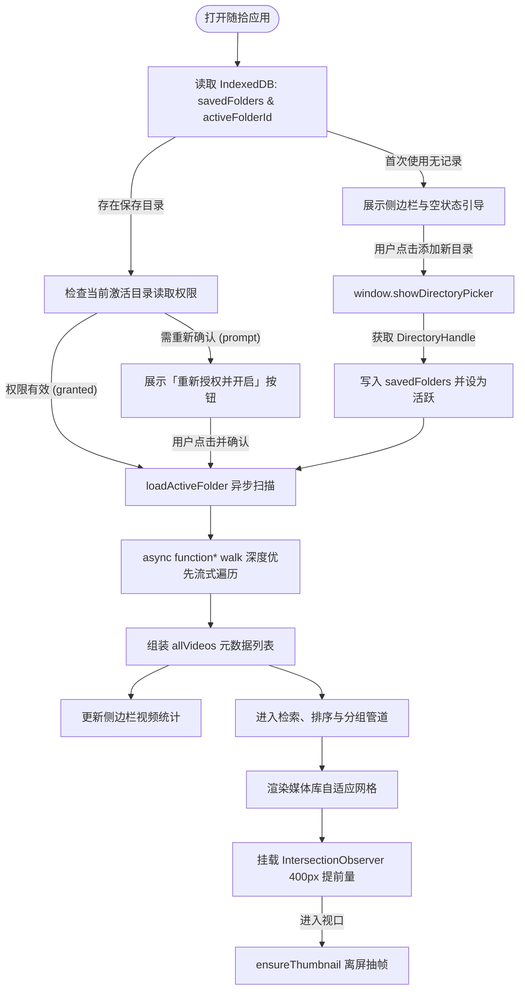

# 随拾 (SuiShi) · 本地短视频抽屉 深度技术文档

> 纯前端、零依赖、单文件架构的本地短视频流媒体浏览工具。依托现代 Chromium 浏览器的原生 Web API，采用温馨亲切的“日常亲切风”（Warm Cozy Aesthetic）设计，配备可伸缩多目录持久化管理侧边栏，提供传统媒体库网格浏览与类似抖音 / TikTok 的沉浸式垂直滑动无缝播放体验。

---

## 目录

- [1. 品牌理念与核心价值](#1-品牌理念与核心价值)
- [2. 整体架构与设计系统](#2-整体架构与设计系统)
- [3. 核心底层技术与 Web API 应用](#3-核心底层技术与-web-api-应用)
  - [3.1 File System Access API（原生本地文件系统访问）](#31-file-system-access-api原生本地文件系统访问)
  - [3.2 IndexedDB 多目录持久化与权限自愈恢复](#32-indexeddb-多目录持久化与权限自愈恢复)
  - [3.3 双重 IntersectionObserver（按需视口渲染引擎）](#33-双重-intersectionobserver按需视口渲染引擎)
  - [3.4 动态 Canvas 离屏抽帧与缩略图缓存系统](#34-动态-canvas-离屏抽帧与缩略图缓存系统)
  - [3.5 严格的内存管理与滑动窗口卸载机制](#35-严格的内存管理与滑动窗口卸载机制)
- [4. 核心功能与交互机制剖析](#4-核心功能与交互机制剖析)
  - [4.1 可伸缩侧边栏与多目录抽屉管理](#41-可伸缩侧边栏与多目录抽屉管理)
  - [4.2 文件夹异步遍历与格式识别](#42-文件夹异步遍历与格式识别)
  - [4.3 智能目录分组与哈希着色导航](#43-智能目录分组与哈希着色导航)
  - [4.4 中文拼音检索与多维排序引擎](#44-中文拼音检索与多维排序引擎)
  - [4.5 媒体库自适应网格卡片系统](#45-媒体库自适应网格卡片系统)
  - [4.6 沉浸式竖屏刷视频流 (Feed Mode)](#46-沉浸式竖屏刷视频流-feed-mode)
  - [4.7 弹窗全功能播放器 (Modal Player)](#47-弹窗全功能播放器-modal-player)
- [5. 数据流与运行状态机](#5-数据流与运行状态机)
- [6. 关键源码逐段深度解析](#6-关键源码逐段深度解析)
- [7. 快捷键指南与用户交互速查](#7-快捷键指南与用户交互速查)
- [8. 运行环境兼容性与已知限制](#8-运行环境兼容性与已知限制)
- [9. 进阶优化与演进建议](#9-进阶优化与演进建议)

---

## 1. 品牌理念与核心价值

随着手机摄影、日常 Vlog、素材片段的日益增多，大家电脑中散落在各个硬盘目录的短视频往往“拍了却很少看”。传统播放器存在界面割裂、缺乏连播体验、生成缩略图迟钝等痛点，而云盘则存在隐私外泄和带宽瓶颈。

**「随拾 (SuiShi)」的诞生初衷**：
- **随手拾起，片刻生活**：像随手拉开书桌抽屉一样轻松翻看生活片段。
- **零构建、零后端、零依赖**：全站纯单文件 (`index.html`) 封装，无需安装 Node.js、npm 或 Python 服务，双击即用或通过本地服务器随开随用。
- **100% 离线隐私安全**：基于现代浏览器沙箱本地读取文件，不产生任何外发网络流量。
- **日常亲切风（Warm Cozy Aesthetic）**：融入暖奶油白、焦糖橙、陶泥灰的舒适手账风视觉，长时间浏览护眼且温馨。
- **双模态沉浸体验**：既能高效管理与检索海量媒体库，又能一键开启类似 TikTok / 抖音的沉浸式无缝上下滑动刷视频模式。

---

## 2. 整体架构与设计系统

```
┌────────────────────────────────────────────────────────────────────────┐
│                      随拾 (SuiShi Video) 架构视图                      │
├────────────────────────────────────────────────────────────────────────┤
│ 表现层 (Presentation Layer - Warm Cozy Aesthetic)                      │
│  - 可伸缩侧栏: 目录抽屉 | + 收藏新目录 | 别名修改 | 移除 | 一键折叠 (Ctrl+B)  │
│  - 顶部导航栏: 实时防抖检索 | 拼音与时间排序 | 包含子目录 | 🔀 刷视频触发 │
│  - 子目录胶囊栏: 顶级子文件夹快速过滤标签 (基于多项式哈希着色算法)     │
│  - 媒体库网格: 响应式自适应网格 | 懒加载封面海报 | 时长与体积元标签    │
│  - 弹窗播放器: 模态视频框 (键盘左右快切, 路径与时间信息)                │
│  - 沉浸式 Feed: CSS Scroll Snap 垂直吸附滑动, 悬浮 HUD, 全屏手势交互   │
├────────────────────────────────────────────────────────────────────────┤
│ 逻辑与调度层 (Control & Scheduling Layer)                               │
│  - Multi-Folder IDB Engine: 多目录句柄持久化、版本迁移与权限自愈唤醒   │
│  - File Scanner: 异步生成器深度遍历 (Async Generator Walk Pipeline)    │
│  - Data Pipe: 检索防抖 (Debounce) -> 分组 (Group) -> 中文拼音排序      │
│  - Sliding Window: Feed 模式下 ±1 滑动窗口内存卸载与流加载调度器        │
│  - Preference Storage: 侧栏折叠状态、静音状态 localStorage 持久化      │
├────────────────────────────────────────────────────────────────────────┤
│ 底层引擎与硬件接口 (Underlying Web APIs)                               │
│  - File System Access API (showDirectoryPicker / FileSystemHandle)     │
│  - IndexedDB (suishi-video-db，持久化目录 Handle 集合与元数据)          │
│  - IntersectionObserver (视口检测，卡片海报抽帧 + Feed 滑动激活)       │
│  - Offscreen Video + 2D Canvas (动态帧截取与 Base64 JPEG 缩略图缓存)   │
│  - HTML5 Video API + URL.createObjectURL (Blob 流式播放控制)           │
│  - LocalStorage (静音与侧栏折叠状态持久化)                             │
└────────────────────────────────────────────────────────────────────────┘
```

---

## 3. 核心底层技术与 Web API 应用

### 3.1 File System Access API（原生本地文件系统访问）
传统网页受安全沙箱限制无法自由读取本地硬盘。本项目利用现代 W3C 标准的 **File System Access API**：
- **目录选择**：调用 `window.showDirectoryPicker({ mode: 'read' })`，用户授权后获得 `FileSystemDirectoryHandle`。
- **异步生成器遍历**：构建 `async function* walk(dirHandle, path, recursive)`。通过 `for await (const entry of dirHandle.values())` 循环迭代，遇到子目录且开启递归时向下遍历，遇到文件且符合格式时使用 `yield` 逐步产出，实现超大目录的非阻塞边扫边统计。
- **流式文件获取**：通过 `handle.getFile()` 获取标准 `File` 对象，读取 `size`、`lastModified` 等基础信息，避免将整个视频加载入内存。

### 3.2 IndexedDB 多目录持久化与权限自愈恢复
`FileSystemDirectoryHandle` 属于结构化克隆对象，可持久化保存于 IndexedDB 中：
- **多目录存储结构**：在 `suishi-video-db` 的 `kv` 表中维护 `savedFolders` 数组，记录文件夹 ID、真实路径名、自定义别名、句柄对象与视频统计数。
- **老版本平滑迁移**：自动兼容旧版单目录键值（`dirHandle`），无缝升级为列表结构。
- **冷启动权限自愈**：页面重载时读取最后激活的目录，先通过 `handle.queryPermission({ mode: 'read' })` 检测状态。若浏览器需要重新确认，自动展示友好的“重新授权并开启”引导，一键唤醒即可继续浏览。

### 3.3 双重 IntersectionObserver（按需视口渲染引擎）
项目中配置了两个维度的 `IntersectionObserver`，将 DOM 渲染与多媒体解码计算彻底解耦：
1. **网格视口交叉观察器 (`io`)**：
   - 配置 `rootMargin: '400px'`。
   - 当用户滚动网格且卡片距离进入视口还有 400px 时，提前触发 `generateThumbnail` 离屏抽帧与获取时长，卡片处理完成后立即 `unobserve`。
2. **Feed 模式双层观察器**：
   - **海报预加载器 (`feedPosterObs`)**：配置 `rootMargin: '150% 0px'`，提前 1.5 屏预加载封面海报。
   - **焦点视频激活器 (`feedActiveObs`)**：配置 `threshold: [0.6]`。当视口相交比例达到 60% 时，精准触发当前视频的自动播放与滑动窗口内存调度。

### 3.4 动态 Canvas 离屏抽帧与缩略图缓存系统
为了在没有预生成海报图的情况下呈现美观的视频封面：
1. **智能选帧机制**：
   - 创建离屏 `<video muted preload="metadata">` 元素；
   - 指针定位在全片 15% 处（最长不超过 3 秒）：`const seekTo = Math.min((vid.duration || 0) * 0.15, 3)`，精准避开开篇黑屏；
   - 提取 2D Canvas 绘制并缩放至 `320×180`，导出高压缩率 JPEG DataURL；
   - 立即调用 `URL.revokeObjectURL(url)` 释放 Blob 对象。
2. **全局 Promise 缓存复用**：
   - 将抽帧过程封装并缓存到视频对象 `v._thumbPromise`，网格卡片与 Feed 流模式共用该结果，全局仅解码一次。

### 3.5 严格的内存管理与滑动窗口卸载机制
针对高频垂直刷视频场景，代码实现了严密的 **Sliding Window Buffer（滑动窗口缓冲区）** 策略：
- **±1 窗口缓冲**：在 Feed 模式中，仅对当前聚焦项的前后 ±1 屏（$N-1$, $N$, $N+1$）保留视频源；
- **移出窗口即刻卸载**：当滑离窗口距离超过 1 屏时，立即执行：
  ```javascript
  slide._video.pause();
  slide._video.removeAttribute('src');
  slide._video.load(); // 强制浏览器底层音视频解码内核释放缓冲区
  URL.revokeObjectURL(slide._objectUrl); // 销毁内存 Blob 引用
  ```
- **弹窗安全销毁**：关闭模态播放器时同样执行 `removeAttribute('src')` 与 `revokeObjectURL`，杜绝内存泄漏。

---

## 4. 核心功能与交互机制剖析

### 4.1 可伸缩侧边栏与多目录抽屉管理
- **双状态平滑切换**：
  - **展开态 (260px)**：展示品牌 Logo、副标、「+ 添加新目录」大按钮、已收藏的目录列表（包含自定义别名、真实名、视频数统计、重命名笔标 ✏️ 与删除标 ✕）。
  - **折叠态 (64px)**：收拢为极简图标导轨，仅保留核心操作与文件夹图标，鼠标悬停即时展示 Tooltip 悬浮标签，最大化释放右侧视频浏览空间。
- **状态记忆**：侧栏折叠状态持久化于 `localStorage('suishi_sidebar_collapsed')`，支持快捷键 `Ctrl + B`（Mac 对应 `Cmd + B`）一键切换。
- **多目录随时切换**：点击侧边栏任意项即可直接切换到对应目录，无需每次重新走文件选择弹窗。

### 4.2 文件夹异步遍历与格式识别
- **格式过滤器**：
  - `VIDEO_EXT`（支持识别列表）：`mp4`, `webm`, `ogg`, `ogv`, `mov`, `m4v`, `mkv`, `avi`, `wmv`, `flv`, `ts`
  - `NATIVE_PLAYABLE`（原生可解码播放）：`mp4`, `webm`, `ogg`, `ogv`, `m4v`, `mov`
- **动态进度反馈**：扫描过程中每发现 25 个视频在顶部状态条实时更新计数，避免大目录用户感知卡顿。

### 4.3 智能目录分组与哈希着色导航
- **顶级子目录提取**：根据相对路径的第一层目录名自动聚合。
- **多项式哈希着色**：采用 `(hash * 31 + charCode) >>> 0` 散列算法映射至预设调色板，使相同文件夹在整站各处拥有恒定一致的标识色。
- **胶囊过滤栏**：当包含多个顶级子文件夹时，在顶部呈现横向滚动的胶囊导航（Pill Bar），支持一键单选过滤或看全部。

### 4.4 中文拼音检索与多维排序引擎
- **防抖检索**：搜索框 150ms Debounce 防抖，支持对文件名与路径进行多维度不区分大小写匹配。
- **中文拼音自然排序**：通过 JavaScript 国际化 API `a.name.localeCompare(b.name, 'zh')`，原生支持中文拼音字母序与数字自然排序，并支持按修改时间、文件体积排序以及一键切换升序/降序（↑/↓）。

### 4.5 媒体库自适应网格卡片系统
- **CSS Grid 自适应**：`repeat(auto-fill, minmax(230px, 1fr))`，随窗口缩放自适应列数。
- **悬停快捷入口**：鼠标悬停卡片时浮现播放按钮（`▶`），点击可直接以当前视频为起点进入沉浸式刷视频流。

### 4.6 沉浸式竖屏刷视频流 (Feed Mode)
- **CSS Scroll Snap 垂直吸附**：`scroll-snap-type: y mandatory` + `100dvh`，滑动阻尼自然流畅。
- **随机乱序播放**：支持勾选「随机顺序」，基于经典的 Fisher–Yates 洗牌算法乱序连播。
- **手势与控制**：单击视频中央暂停/播放并浮现微动效指示器；顶部 HUD 包含集数进度（如 `5 / 68`）、全局静音切换及退出按钮。

### 4.7 弹窗全功能播放器 (Modal Player)
- 居中模态对话框，支持标准全屏、音量、进度拖拽原生控件，支持键盘左右方向键无缝切换上下集。

---

## 5. 数据流与运行状态机



---

## 6. 关键源码逐段深度解析

### 6.1 多目录结构管理与状态保存
```javascript
async function saveFolderState() {
  await idbSet('savedFolders', savedFolders);
  await idbSet('activeFolderId', activeFolderId);
}

async function removeFolder(id) {
  savedFolders = savedFolders.filter(f => f.id !== id);
  if (activeFolderId === id) {
    activeFolderId = savedFolders.length ? savedFolders[0].id : null;
  }
  await saveFolderState();
  renderSidebar();
  if (activeFolderId) {
    switchFolder(activeFolderId);
  } else {
    allVideos = [];
    filtered = [];
    gridEl.innerHTML = '';
    folderBarEl.classList.remove('show');
    statsEl.textContent = '';
    setControlsEnabled(false);
    emptyState.style.display = 'flex';
  }
}
```
> **设计考量**：
> 1. 数据原子化同步：每次目录新增、别名修改、删除均同步持久化至 IndexedDB；
> 2. 状态平滑降级：删除当前激活目录时，自动顺延切换到下一个已有目录，若列表清空则恢复至干净的初始空状态。

### 6.2 侧边栏折叠与快捷键响应
```javascript
function initSidebar() {
  const isCollapsed = localStorage.getItem('suishi_sidebar_collapsed') === 'true';
  if (isCollapsed) sidebarEl.classList.add('collapsed');

  btnToggleSidebar.addEventListener('click', () => {
    sidebarEl.classList.toggle('collapsed');
    localStorage.setItem('suishi_sidebar_collapsed', sidebarEl.classList.contains('collapsed'));
  });

  document.addEventListener('keydown', (e) => {
    if ((e.ctrlKey || e.metaKey) && e.key.toLowerCase() === 'b') {
      e.preventDefault();
      sidebarEl.classList.toggle('collapsed');
      localStorage.setItem('suishi_sidebar_collapsed', sidebarEl.classList.contains('collapsed'));
    }
  });
}
```
> **设计考量**：
> 1. 经典高效的快捷键定义：支持通用 IDE/应用习惯的 `Ctrl+B`（或 `Cmd+B`）一键切换；
> 2. 纯 CSS 平滑缓动过渡，折叠时自动将宽度收缩到 64px 导轨模式，配合 `[data-tooltip]` 悬浮说明，兼具美感与功能性。

---

## 7. 快捷键指南与用户交互速查

### 全局与侧边栏
| 快捷键 / 手势 | 功能说明 |
| :--- | :--- |
| **Ctrl + B / Cmd + B** | 一键折叠 / 展开左侧抽屉侧边栏 |
| **点击侧栏条目** | 即时切换至对应的视频目录库 |
| **侧栏条目悬停 ✏️** | 修改该目录在侧栏显示的自定义别名备注 |
| **侧栏条目悬停 ✕** | 从侧栏收藏中移除该目录（安全操作，不删除硬盘视频） |

### 网格媒体库
| 操作 | 功能说明 |
| :--- | :--- |
| **单击卡片** | 打开弹窗常规播放器 |
| **卡片悬停点击 ▶** | 以该视频为第一项，直接进入沉浸式竖屏刷视频流 |
| **点击顶部「🔀 刷视频」** | 从列表首项开启刷视频流（勾选「随机顺序」则乱序播放） |
| **搜索框实时输入** | 150ms 自动防抖匹配文件名与相对路径 |

### 沉浸式竖屏短视频流 (Feed Mode)
| 快捷键 / 手势 | 功能说明 |
| :--- | :--- |
| **方向键下 (↓) / PageDown / 触控下滑** | 平滑滚屏切换至下一个视频 |
| **方向键上 (↑) / PageUp / 触控上滑** | 平滑滚屏切换至上一个视频 |
| **空格键 (Space) / 单击屏幕画面** | 播放 / 暂停当前视频 |
| **右上角 🔇 / 🔊** | 切换全局静音状态（自动持久化保存） |
| **Esc 键 / 左上角 ✕** | 退出刷视频模式并即刻释放流媒体内存 |

---

## 8. 运行环境兼容性与已知限制

### 8.1 浏览器支持
- **推荐**：Google Chrome (86+)、Microsoft Edge (86+) 或任何现代 Chromium 架构浏览器；
- **不推荐**：Firefox / Safari（目前尚未对桌面目录读写开放标准的 `showDirectoryPicker` 规范）。

### 8.2 运行环境建议
推荐通过本地简易 HTTP 服务打开：
```bash
# 方式一：Node.js
npx serve .

# 方式二：Python 3
python -m http.server 8000

# 方式三：VS Code 扩展
使用 Live Server 点击右下角 Go Live
```
*注：部分浏览器对于 `file://` 协议的安全策略较为严格，在 `http://localhost` 上可获得最佳的 API 权限支持。*

---

## 9. 进阶优化与演进建议

1. **WebCodecs 极速后台抽帧**：后续可探索利用 Web Worker + `WebCodecs` 硬件解码器在工作线程中进行超大规模视频后台提取，进一步降低主线程负担。
2. **标签与收藏标记**：结合现有的 IndexedDB 架构，可为单个视频文件提供“心标收藏”或自定义标签分类功能。
3. **断点续播记忆**：持久化每个视频最后一次的播放进度秒数，再次打开自动从上次离开的位置继续放映。
