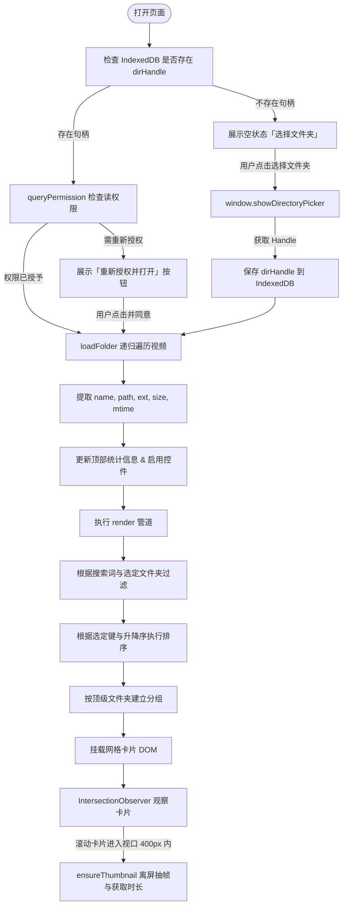
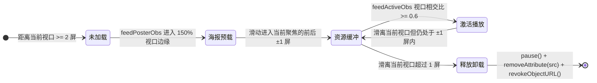

# 本地短视频浏览器 (Local Video Browser) 深度技术文档

> 纯前端、零依赖、单文件架构的本地短视频流媒体浏览工具。依托现代 Chromium 浏览器的原生 Web API，为本地视频资源提供类似抖音 / TikTok 的沉浸式垂直滑动交互及多功能媒体库管理体验。

---

## 目录

- [1. 项目概述与核心价值](#1-项目概述与核心价值)
- [2. 整体架构与设计原则](#2-整体架构与设计原则)
- [3. 核心底层技术与 Web API 应用](#3-核心底层技术与-web-api-应用)
  - [3.1 File System Access API（原生本地文件系统访问）](#31-file-system-access-api原生本地文件系统访问)
  - [3.2 IndexedDB 句柄持久化与免二次选择](#32-indexeddb-句柄持久化与免二次选择)
  - [3.3 双重 IntersectionObserver（按需视口渲染引擎）](#33-双重-intersectionobserver按需视口渲染引擎)
  - [3.4 动态 Canvas 离屏抽帧与缩略图系统](#34-动态-canvas-离屏抽帧与缩略图系统)
  - [3.5 严格的内存管理与滑动窗口卸载机制](#35-严格的内存管理与滑动窗口卸载机制)
- [4. 核心功能与交互机制剖析](#4-核心功能与交互机制剖析)
  - [4.1 文件夹递归遍历与格式识别](#41-文件夹递归遍历与格式识别)
  - [4.2 智能目录分组与哈希着色导航](#42-智能目录分组与哈希着色导航)
  - [4.3 检索过滤与本地化拼音排序引擎](#43-检索过滤与本地化拼音排序引擎)
  - [4.4 媒体库卡片网格系统](#44-媒体库卡片网格系统)
  - [4.5 弹窗全功能播放器 (Modal Player)](#45-弹窗全功能播放器-modal-player)
  - [4.6 沉浸式竖屏刷视频模式 (TikTok-style Feed Mode)](#46-沉浸式竖屏刷视频模式-tiktok-style-feed-mode)
- [5. 数据流与运行状态机](#5-数据流与运行状态机)
- [6. 关键源码逐段深度解析](#6-关键源码逐段深度解析)
- [7. 快捷键指南与用户交互速查](#7-快捷键指南与用户交互速查)
- [8. 运行环境兼容性与已知限制](#8-运行环境兼容性与已知限制)
- [9. 进阶优化与演进建议](#9-进阶优化与演进建议)

---

## 1. 项目概述与核心价值

随着本地多媒体文件（尤其是手机拍摄、剪辑导出、短视频素材）的快速增加，传统的操作系统资源管理器或常规桌面播放器面临以下痛点：
1. **浏览效率低**：系统文件管理器的大图标模式生成预览慢，双击打开第三方播放器窗口割裂。
2. **缺乏沉浸感**：无法像现代移动端短视频产品（抖音、TikTok、Reels）一样进行无缝的上下滑动连播。
3. **隐私与安全顾虑**：将私人视频导入在线云盘或私有云平台耗费大量上传带宽，存在泄露风险。
4. **环境依赖重**：常规本地媒体管理工具（如 Jellyfin、Plex）需要部署后端服务、Node.js 运行时或数据库。

**本项目解决方案**：
- **零构建、零后端、零依赖**：整个项目封装在单个独立的 `index.html`（HTML5 + 原生 JavaScript ES6+ + CSS3）中，无需任何第三方框架、Node.js 或 npm 依赖。
- **100% 本地隐私安全**：完全基于浏览器沙箱读取本地存储，所有视频解码、缩略图提取、排序检索全部在客户端本地完成，绝不向任何远程服务器传输数据。
- **双模态无缝切换**：既支持桌面级媒体库的“目录分组网格视图”，又支持移动端体验的“全屏沉浸式竖屏滑动刷视频”模式。

---

## 2. 整体架构与设计原则

```
┌────────────────────────────────────────────────────────────────────────┐
│                        本地短视频浏览器架构视图                        │
├────────────────────────────────────────────────────────────────────────┤
│ 表现层 (Presentation Layer)                                            │
│  - 头部工具栏: 文件夹选择 | 搜索过滤 | 多维排序 | 包含子目录 | 刷视频触发 │
│  - 目录胶囊导航: 顶级文件夹标签过滤 (基于哈希算法的动态色彩标识)       │
│  - 媒体库网格: 响应式卡片流 (自适应列宽, 懒加载海报, 时长与体积元信息)  │
│  - 弹窗播放器: 模态视频框 (键盘快切, 路径与时间信息)                    │
│  - 沉浸式 Feed: CSS Scroll Snap 垂直吸附滑动, 悬浮 HUD 状态层          │
├────────────────────────────────────────────────────────────────────────┤
│ 逻辑与调度层 (Control & Scheduling Layer)                               │
│  - File Scanner: 异步生成器深度遍历 (Async Generator Walk Pipeline)    │
│  - Data Pipe: 检索防抖 (Debounce) -> 分组 (Group) -> 拼音排序 (Sort)    │
│  - Sliding Window: Feed 模式下 ±1 滑动窗口内存卸载与流加载调度器        │
│  - Lifecycle: 浏览器权限生命周期管理与页面唤醒恢复机制                 │
├────────────────────────────────────────────────────────────────────────┤
│ 底层引擎与硬件接口 (Underlying Web APIs)                               │
│  - File System Access API (showDirectoryPicker / FileSystemHandle)     │
│  - IndexedDB (kv 存储，持久化目录 Handle)                              │
│  - IntersectionObserver (视口检测，卡片海报抽帧 + Feed 滑动激活)       │
│  - Offscreen Video + 2D Canvas (动态帧截取与 Base64 JPEG 缩略图缓存)   │
│  - HTML5 Video API + URL.createObjectURL (Blob 流式播放控制)           │
│  - LocalStorage (静音状态持久化)                                       │
└────────────────────────────────────────────────────────────────────────┘
```

### 设计原则：
1. **轻量与自洽 (Self-contained)**：单一文件直接分发，任何基于 Chromium 的浏览器均可秒级运行。
2. **性能与内存友好 (Memory First)**：视频通常具备较大体积，必须采用“按需抽取、视口渲染、超出卸载”机制，避免几百个视频导致标签页内存溢出崩溃。
3. **东方传统美学设计 (Visual Aesthetics)**：配色方案取材自中国传统色系（荼白 `#F3F9F1`、靛青 `#177CB0`、苍色 `#75878A` 等），界面沉稳雅致。

---

## 3. 核心底层技术与 Web API 应用

### 3.1 File System Access API（原生本地文件系统访问）
传统 Web 页面无法直接以读写权限访问操作系统目录。本项目利用现代 W3C 标准的 **File System Access API**：
- **目录选择**：调用 `window.showDirectoryPicker({ mode: 'read' })`，用户授权后获得 `FileSystemDirectoryHandle`。
- **异步生成器遍历**：构建 `async function* walk(dirHandle, path, recursive)`。通过 `for await (const entry of dirHandle.values())` 循环迭代，遇到子目录且开启递归时递归向下遍历，遇到文件且符合扩展名时使用 `yield` 逐步产出。
- **流式文件获取**：通过 `handle.getFile()` 获取标准 `File` 对象，读取元数据（`size`, `lastModified`）而无需一次性将文件载入内存。

### 3.2 IndexedDB 句柄持久化与免二次选择
`FileSystemDirectoryHandle` 属于可序列化的结构化对象（Structured Clone Algorithm），但不可直接存入 `localStorage`。
- **IndexedDB 存储**：代码中封装了微型异步键值库 `idbOpen()`, `idbSet()`, `idbGet()`，将 `dirHandle` 保存到数据库 `local-video-browser` 的 `kv` 表中。
- **冷启动静默恢复**：页面加载时自动执行 `tryRestore()`：
  1. 从 IndexedDB 提取缓存的 `dirHandle`；
  2. 执行 `handle.queryPermission({ mode: 'read' })` 检测权限状态；
  3. 若权限已是 `granted`，立即无感知加载目录；
  4. 若浏览器会话重置要求确认，空状态区域展示“重新授权并打开”引导按钮，只需点击一次即可复原。

### 3.3 双重 IntersectionObserver（按需视口渲染引擎）
项目中配置了两个维度的 `IntersectionObserver`，将 DOM 渲染与多媒体资源加载完全解耦：
1. **网格视口交叉观察器 (`io`)**：
   - 配置 `rootMargin: '400px'`。
   - 当用户向下滚动网格且卡片距离进入视口还有 400px 时，触发 `generateThumbnail`，生成缩略图与时长；卡片被触发后立即 `unobserve` 避免重复开销。
2. **Feed 模式双层观察器**：
   - **海报预加载器 (`feedPosterObs`)**：配置 `rootMargin: '150% 0px'`，提前 1.5 屏预生成海报图，消除白屏等待感。
   - **焦点视频激活器 (`feedActiveObs`)**：配置 `threshold: [0.6]`。当某一屏滑动至视口暴露比例超过 60% 时，触发 `activateFeedIndex` 进行智能播放与内存调度。

### 3.4 动态 Canvas 离屏抽帧与缩略图系统
为了在无需外部图片的情况下直接呈现精准的视频封面：
1. **智能选帧机制**：
   - 创建离屏 `<video>` 元素，设置 `preload = 'metadata'` 与 `muted = true`。
   - 监听 `loadedmetadata` 事件读取 `duration`（总时长）。
   - 将播放指针定位在全片 15% 处（最长不超过 3 秒）：`const seekTo = Math.min((vid.duration || 0) * 0.15, 3)`，该策略能有效避开大多数视频片头的纯黑帧或空白画面。
2. **Canvas 尺寸缩放与压缩**：
   - 监听 `seeked` 事件，创建 `320×180` 的离屏 Canvas；
   - 采用 `Math.max(320 / vw, 180 / vh)` 计算等比居中裁剪（类似 `object-fit: cover`）；
   - 导出 `canvas.toDataURL('image/jpeg', 0.7)` 高压缩率封面图；
   - 立即调用 `URL.revokeObjectURL(url)` 释放中间 Blob 资源。
3. **Promise 缓存复用机制**：
   - 将抽帧过程的 Promise 缓存至 `v._thumbPromise`，网格卡片与 Feed 模式共用同一套缓存，同一视频全局仅解码一次。

### 3.5 严格的内存管理与滑动窗口卸载机制
本地视频文件常为数百 MB 甚至上 GB，多个 `<video>` 实例如果常驻内存会导致极其严重的性能滑坡。代码实现了精密的内存防护策略：
- **滑动窗口（Sliding Window Buffer）**：
  在沉浸式 Feed 模式中，只激活与当前聚焦卡片距离在 `±1` 以内的视频（即前一个、当前、后一个）：
  ```javascript
  if (Math.abs(i - idx) <= 1) {
    loadFeedSlideSrc(slide); // 加载并在当前屏自动播放
  } else {
    unloadFeedSlideSrc(slide); // 立即暂停、清空 src 并销毁 Object URL
  }
  ```
- **资源安全释放**：
  `unloadFeedSlideSrc` 明确执行：
  ```javascript
  slide._video.pause();
  slide._video.removeAttribute('src');
  slide._video.load(); // 强制通知浏览器多媒体引擎释放内部缓冲区
  if (slide._objectUrl) {
    URL.revokeObjectURL(slide._objectUrl);
    slide._objectUrl = null;
  }
  ```
- **弹窗关闭回收**：
  关闭 Modal 播放器时同样执行 `removeAttribute('src')` 与 `revokeObjectURL`，杜绝内存泄漏。

---

## 4. 核心功能与交互机制剖析

### 4.1 文件夹递归遍历与格式识别
- **格式过滤器**：
  - `VIDEO_EXT`（支持识别列表）：`mp4`, `webm`, `ogg`, `ogv`, `mov`, `m4v`, `mkv`, `avi`, `wmv`, `flv`, `ts`
  - `NATIVE_PLAYABLE`（原生浏览器可解码格式）：`mp4`, `webm`, `ogg`, `ogv`, `m4v`, `mov`
- **动态进度反馈**：每扫描发现 25 个视频即在顶部状态栏更新计数（如 `正在扫描文件夹… 已找到 75 个视频`），防止大目录扫描时用户感知卡顿。

### 4.2 智能目录分组与哈希着色导航
- **顶级目录识别**：通过 `topFolderOf(v)` 提取视频文件相对路径的第一级目录名，若位于根目录则归入 `（根目录）`。
- **色彩哈希算法 (`colorForFolder`)**：
  对文件夹名称进行简易多项式散列计算：
  $$\text{hash} = \sum_{i=0}^{n-1} (\text{hash} \times 31 + \text{codePointAt}(i)) \pmod{2^{32}}$$
  在 10 种精选调色板色值中取模映射，确保相同的文件夹名称在整站所有视图中呈现绝对一致的色彩标识。
- **胶囊过滤栏 (`#folder-bar`)**：当检测到多个顶级目录时自动展开横向滚动的 Pill 栏，点击可无刷新单选过滤或查看全部。

### 4.3 检索过滤与本地化拼音排序引擎
- **防抖检索**：在搜索框输入时提供 150ms 的防抖响应，对文件名与路径执行不区分大小写的子串匹配。
- **多条件精准排序**：
  - `name`（文件名）：采用 JavaScript 国际化 API `a.name.localeCompare(b.name, 'zh')`，原生支持中文拼音字母序与数字自然排序。
  - `date`（修改时间）：根据文件元数据 `mtime` 的时间戳排序。
  - `size`（文件大小）：按字节大小精确排序。
  - 支持 `↑ / ↓` 按钮快速切换升降序。

### 4.4 媒体库卡片网格系统
- **CSS Grid 自适应**：`repeat(auto-fill, minmax(220px, 1fr))`，在任何屏幕分辨率下自动计算最适列数。
- **右上角快捷入口**：鼠标悬停卡片时浮现悬浮播放键（`▶`），点击可直接以当前视频为起点进入沉浸式短视频流模式。
- **卡片元数据**：以紧凑布局展示格式徽标（如 MP4）、视频时长、文件名、相对路径及文件大小。

### 4.5 弹窗全功能播放器 (Modal Player)
- 点击网格卡片激活弹窗模式，支持标准的系统级 Video 控件（音量调节、进度条拖拽、全屏切换等）。
- 左右悬浮翻页按钮与左/右方向键绑定，支持无缝切换列表上下视频。

### 4.6 沉浸式竖屏刷视频模式 (TikTok-style Feed Mode)
- **CSS Scroll Snap 垂直吸附**：
  - 容器启用 `scroll-snap-type: y mandatory` 与 `overscroll-behavior: contain`。
  - 每屏尺寸均为 `100dvh`（动态视口高度，自动适配移动端与桌面浏览器地址栏变化），滑动阻尼自然贴合。
- **随机乱序播放 (Shuffle)**：
  - 工具栏勾选“随机顺序”后进入，使用经典的 **Fisher–Yates 洗牌算法**（`shuffleArray`）生成无序播放列表，大幅增加“刷”视频时的趣味性。
- **单击屏幕暂停/播放交互**：
  - 点击视频区域自由切换播放/暂停状态，中心浮现平滑淡出的拟物化播放图标（`.pause-icon`）。
- **HUD 悬浮控制层**：
  - 顶部显示总集数与当前播放序数（如 `3 / 48`）。
  - 全局静音键，并自动将偏好同步至 `localStorage('feedMuted')`，后续访问自动沿用。

---

## 5. 数据流与运行状态机

### 5.1 数据初始化与渲染流向



### 5.2 沉浸式 Feed 模式滑动窗口生命周期



---

## 6. 关键源码逐段深度解析

### 6.1 异步生成器扫描目录
```javascript
async function* walk(dirHandle, path, recursive) {
  for await (const entry of dirHandle.values()) {
    if (entry.kind === 'file') {
      if (isVideoFile(entry.name)) yield { handle: entry, path };
    } else if (entry.kind === 'directory' && recursive) {
      yield* walk(entry, path ? `${path}/${entry.name}` : entry.name, recursive);
    }
  }
}
```
> **设计考量**：采用 ES2018 异步生成器（`async function*` + `for await...of`）。相较于一次性将所有子文件数组塞入内存，生成器模式以流式管道逐个产出结果，能够在扫描超大目录时边扫描边统计进度，有效降低内存峰值。

### 6.2 离屏抽帧与 Base64 缩略图缓存
```javascript
function ensureThumbnail(v) {
  if (v._thumbPromise) return v._thumbPromise;
  v._thumbPromise = (async () => {
    if (!NATIVE_PLAYABLE.includes(v.ext)) return null;
    let file, url;
    try {
      file = await v.handle.getFile();
      url = URL.createObjectURL(file);
    } catch { return null; }

    return await new Promise((resolve) => {
      const vid = document.createElement('video');
      vid.muted = true;
      vid.preload = 'metadata';
      vid.src = url;
      const cleanup = () => URL.revokeObjectURL(url);

      vid.addEventListener('loadedmetadata', () => {
        if (isFinite(vid.duration)) v._duration = vid.duration;
        const seekTo = Math.min((vid.duration || 0) * 0.15, 3);
        try { vid.currentTime = seekTo; } catch { drawFrame(); }
      }, { once: true });
      vid.addEventListener('seeked', drawFrame, { once: true });
      vid.addEventListener('error', () => { cleanup(); resolve(null); }, { once: true });

      function drawFrame() {
        try {
          const canvas = document.createElement('canvas');
          canvas.width = 320;
          canvas.height = 180;
          const ctx = canvas.getContext('2d');
          const vw = vid.videoWidth, vh = vid.videoHeight;
          if (vw && vh) {
            const scale = Math.max(320 / vw, 180 / vh);
            const dw = vw * scale, dh = vh * scale;
            ctx.drawImage(vid, (320 - dw) / 2, (180 - dh) / 2, dw, dh);
            const dataUrl = canvas.toDataURL('image/jpeg', 0.7);
            cleanup();
            resolve(dataUrl);
            return;
          }
        } catch {}
        cleanup();
        resolve(null);
      }
    });
  })();
  return v._thumbPromise;
}
```
> **设计考量**：
> 1. 利用 `once: true` 自动解除一次性事件监听，避免内存泄漏；
> 2. `seekTo` 避开开篇全黑，通过裁剪比例缩放到统一的 `320×180` 尺寸，保持界面卡片高度整齐；
> 3. 及时调用 `cleanup()`（执行 `revokeObjectURL`），确保临时离屏 Blob 快速被垃圾回收。

### 6.3 Feed 模式滑动窗口调度逻辑
```javascript
function activateFeedIndex(idx) {
  feedIndex = idx;
  feedCounter.textContent = `${idx + 1} / ${feedList.length}`;
  const slides = feedEl.children;
  for (let i = 0; i < slides.length; i++) {
    const slide = slides[i];
    if (Math.abs(i - idx) <= 1) {
      loadFeedSlideSrc(slide).then(() => {
        if (i === feedIndex && feedEl.classList.contains('show')) {
          slide._video.muted = feedMuted;
          slide._video.play().catch(() => {});
        }
      });
    } else {
      unloadFeedSlideSrc(slide);
    }
    if (i !== idx && slide._video.src) {
      slide._video.pause();
      slide.classList.remove('paused');
    }
  }
}
```
> **设计考量**：
> 1. 当视口滚动至第 $N$ 屏时，只有 $N-1$、$N$、$N+1$ 屏加载媒体源；
> 2. 当用户快速连续向下滑动时，已被甩至视口上方的第 $N-2$ 屏及更早元素，其视频数据源将被立刻释放，从而使页面维持在极低的内存占用状态。

---

## 7. 快捷键指南与用户交互速查

### 全局 / 网格界面
| 操作 / 快捷键 | 功能描述 |
| :--- | :--- |
| **点击卡片** | 打开常规弹窗播放器，显示详细元数据与原生控制条 |
| **悬停卡片点击 ▶** | 以该视频为起始位置，直接切入全屏垂直刷视频模式 |
| **点击顶部「🔀 刷视频」** | 从列表首项开始进入刷视频模式（若勾选「随机顺序」则全局乱序播放） |

### 沉浸式短视频流模式 (Feed Mode)
| 快捷键 / 鼠标手势 | 功能描述 |
| :--- | :--- |
| **方向键下 (↓) / PageDown / 触控下滑** | 顺畅滚屏切换至下一个视频 |
| **方向键上 (↑) / PageUp / 触控上滑** | 顺畅滚屏切换至上一个视频 |
| **空格键 (Space) / 单击画面任何区域** | 暂停 / 恢复当前视频播放（带中央动态指示图标） |
| **点击右上角 🔇 / 🔊** | 切换全局静音状态（自动持久化至本地存储） |
| **Esc 键 / 点击左上角 ✕** | 立即退出刷视频模式，释放全屏流缓冲 |

### 弹窗播放器模式 (Modal Mode)
| 快捷键 / 手势 | 功能描述 |
| :--- | :--- |
| **方向键左 (←) / 点击左侧 ‹ 按钮** | 切换至上一个视频 |
| **方向键右 (→) / 点击右侧 › 按钮** | 切换至下一个视频 |
| **Esc 键 / 点击空白遮罩处 / 点击右上 ✕** | 关闭弹窗播放器并销毁当前视频 URL |

---

## 8. 运行环境兼容性与已知限制

### 8.1 浏览器支持要求
| 浏览器类型 | 支持情况 | 最低版本要求 | 说明 |
| :--- | :---: | :---: | :--- |
| **Google Chrome** | ✅ 完全支持 | 86+ | 原生支持 File System Access API |
| **Microsoft Edge** | ✅ 完全支持 | 86+ | 原生支持 File System Access API |
| **Brave / Opera 等** | ✅ 完全支持 | 最新内核 | 基于 Chromium 即可运行 |
| **Mozilla Firefox** | ⚠️ 不支持 | - | 尚未实现 `showDirectoryPicker` 规范 |
| **Apple Safari** | ⚠️ 不支持 | - | 尚未实现桌面端文件夹选取规范 |

> **运行提示**：
> 推荐通过简单的本地静态服务器（如 VS Code 扩展 `Live Server`、Python `python -m http.server 8000` 或 Node.js `npx serve .`）打开页面。若直接双击 `index.html`（`file://` 协议）在部分严格安全策略的浏览器中可能受限，`http://localhost` 为最佳运行上下文。

### 8.2 多媒体编码格式限制
浏览器内部依靠内置的媒体解码器：
- **完全兼容并支持自动抽帧**：`MP4 (H.264 / AAC)`, `WebM (VP8 / VP9 / AV1)`, `OGG`, `MOV`
- **部分限制**：部分包含 `H.265 (HEVC)` 高级编码的 MP4 文件取决于操作系统是否安装了硬件解码扩展；`MKV`, `AVI`, `FLV`, `TS` 文件受浏览器内核支持限制可能无法直接解码播放。

---

## 9. 进阶优化与演进建议

如果未来对该项目进行后续迭代或功能增强，推荐以下演进方向：

1. **WebCodecs + Web Worker 缩略图后台管线**：
   - 目前封面抽帧在主线程离屏 Video 运行，视频量非常大时偶尔有排队开销。可将非阻塞抽帧交由 Web Worker + `OffscreenCanvas` 或 `WebCodecs` 解码，进一步解放主线程。
2. **格式降级与软解码增强**：
   - 针对浏览器无法播放的 `MKV` 或 `FLV`，可按需动态加载轻量级 WebAssembly 解码库（如 `ffmpeg.wasm` 或 `flv.js`），实现更广域的文件兼容。
3. **标签收藏与播放历史**：
   - 结合现有的 IndexedDB 架构，可增加对视频的“喜爱 / 收藏”功能、播放位置记忆（断点续播）或自定义多标签管理。
4. **手势与触屏滑动体验微调**：
   - 适配移动端/平板设备上的 Touch 滑动手势加速度感应，提供类似原生 App 的双击点赞或滑动调节音量/亮度手势。
